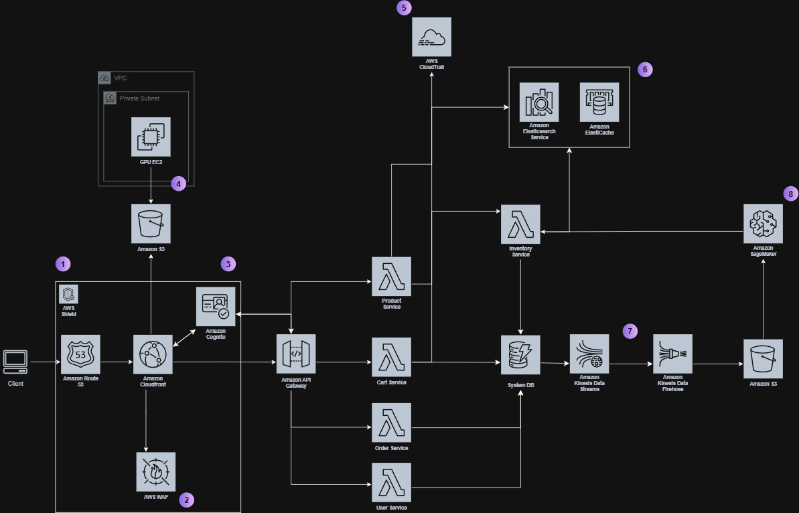

# Design a 3D E-Commerce Platform Architecture on AWS

## Problem Section

### Task Definition

I are part of a startup team launching a next-generation 3D e-commerce web application. This platform will allow users to interact with 3D models of products (e.g., furniture, gadgets, fashion items) before purchasing. Millions of users are expected globally, and the experience must be fast, highly available, secure, and cost-efficient. 

As a Cloud Practitioner, my role is to design the cloud architecture using AWS services to support this 3D application and meet key business and technical requirements.

| Functional Requirements | Non-functional Requirements |
|---|---|
|User authentication|Scalability|
|Shopping cart |High availability
|Order management | Security
|Payment processing |Fault Tolerance
|Inventory management| Security
|Product Search| Low Latency|
|Recommendations|Real-time processing|
|Analytics|
|3D Renderer|

---

### Task Estimates
This section is used to make estimates that will be used to select suitable services
**Assumption: 10M daily active users (DAU)**
- Traffic: 
    - Product catalog, inventory management
        - 10M DAU * 5 page views/user = 50M page views per day
        - 50M / (24 * 3600) = 580 avg QPS (queries per second)
        - Peak QPS = 2 * AVG QPS = 580 * 2 = 1160 QPS
    - Payment, Order, Inventory
        - 50% conversion (50% of users make purchases), 5M orders per day with at least 1 item in order
        - 5M sales/day / (24*3600 seconds) = 58 avg QPS
        - Peak QPS = 2 * AVG QPS = 58 * 2 = 116 QPS
- Storage
    - Users: 10M * 1KB/user = 10GB
    - Products: 
        - 10M *10KB/Product = 100GB (Product info)
        - 10M * 20MB/Product = 200Tb (3d model data)
        - Orders: 5M orders/day * 5KB/order * 365  = 9.125 TB per year
        - Total: 209.235TB

---
## Solution Section
### AWS Architecture Diagram

#### Architecture breakdown 

1. Shield protects CloudFront and Route 53 from DDoS attacks.
2. WAF filters and blocks malicious web traffic in CloudFront.
3. Cognito used to authenticate users and authenticate requests to Lambda endpoints
4. GPU EC2 is used to render frames of 3D objects which are stored in S3 and provided to users using Cloudfront (Renders are cache which saves on compute).
5. CloudTrail is enabled at the account level to capture all API activity across AWS services.
6. Frequently bought or viewed products as well as AI/ML recommendations are cached
7. Events from DynamoDB is fed into Kinesis Data Streams then Kinesis Data Firehose to be stored in S3
8. Stored data is used in SageMaker to generate AI/ML models to generate recommendations and optimizations for inventory.

|Requirements|How Architecture Satisfies Requirement|
|---|---|
|High Availability|AWS Lambda, Route 53 + Health Checks. Route traffic to healthy endpoints (Failover if one region/AZ goes down). Multi-AZ Setup for Dynamo DB. If one AZ goes down for Lambda, it automatically reroutes traffic to instances in other AZs|
|Scalability|Lambda auto-provisions instances of our backend services, allowing it to seamlessly scale and handle sudden traffic spikes. DynamoDB has near infinite horizontal scalability so it can serve millions of users without fail.|
|Performance|Amazon CloudFront to keep cached versions available at the edge and for faster delivery of content. Amazon DynamoDB to scale storage/throughput up or down automatically and provides single-digit millisecond response times at any scale|
|Security|Amazon Cognito authenticates users and is used to authenticate any request a user tries to make. Shield protects Frontend from DDOS attacks. WAF filters and blocks any malicious traffic to the Frontend.|
|Cost Optimization|AWS Lambda runs code only when invoked so the backend compute does not cost anything unless it's serving a customer. GPU EC2 renders will be stored in S3, effectively caching the output and saving on compute.
|

### Solution Tradeoffs or Challenges
|Design Choice|Tradeoff/Challenge|
|---|---|
|Amazon S3 for storage|Gives reliable storage for 3D models, however storing and serving huge files can get expensive, especially when millions of users are downloading assets|
|Lambda & API Gateway (serverless APIs)|Serverless is perfect for handling spiky traffic at low cost, but long or complex tasks (like rendering) can exceed Lambda’s limits. Cold starts can also slow down responses. For that reason, we’ll keep Lambda for lightweight APIs and route heavier jobs to EC2 or containers.|
|DynamoDB (databases)|Scales well for product catalog lookups but doesn’t handle complex queries easily. To overcome this, we’ll pair DynamoDB with caching and possibly OpenSearch for advanced searches.|
|Cognito for authentication|Makes sign-ups and logins easier, but customization is limited and big traffic spikes can hit quotas.|
|SageMaker for AI/ML|Main tradeoffs are complexity and cost. Training ML models can be expensive depending on scale. Integrating SageMake with the current data pipeline will require careful orchestration and monitoring.|
|||

