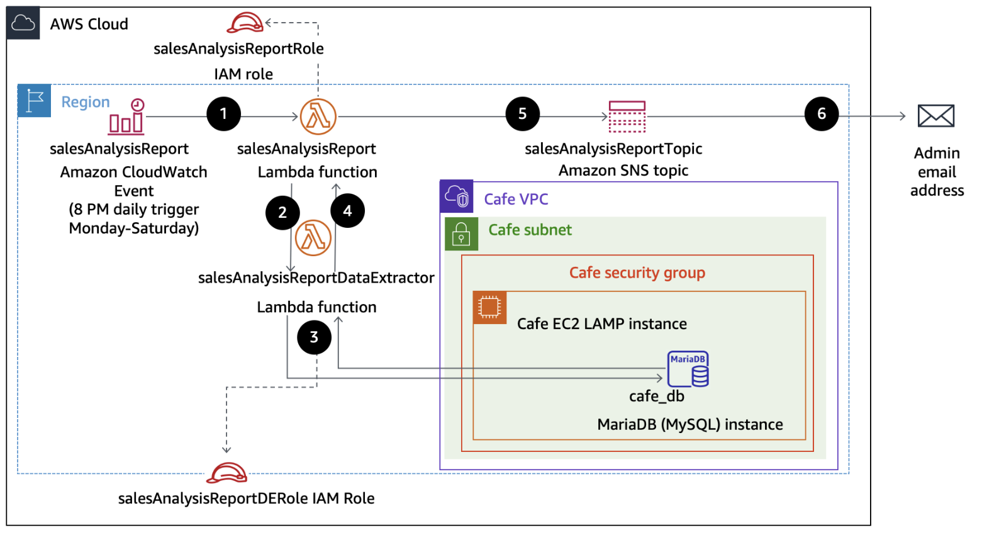

# Compute Lab 171: Creating Amazon EC2 Instances

## Overview
In this lab, I will walkthrough the process of launching EC2 Instances on AWS. I will create an instance using the AWS Management Console then use that instance as a bastion host to launch another EC2 instance.

## Objectives
1. Launch EC2 instance from the AWS Management Console
2. Connect to the EC2 instance by using EC2 Instance Connect 
3. Launch an EC2 instance by using the AWS CLI

## AWS Services Used
- AWS Management Console
- Amazon EC2
- EC2 Instance Connect
- AWS CLI 
- Amazon VPC

## Architecture Diagram


## Pre-requisites
- AWS account with proper permissions

## Steps Taken
### Task 1: EC2 instance creation from Management Console
1. Navigate in the AWS Management Console to EC2 Management Console
2. Choose Launch Instance 
3. Enter Bastion host as **Name** 
4. Choose an appropriate AMI - Amazon Linux 2
5. Choose Instance Type - t3.micro
6. In Key pair (login) section - Choose proceed without key pair
7. Configure Networking: 
    7.1 Choose **Lab VPC** 

    7.2 Choose **Public Subnet**
    
    7.3 In Firewall (Security groups), configure security group using the following options: 
    ```
    Security Group Name: Bastion security group
    Description: Permit SSH connections
    ```
8. Configure storage - keep default storage configuration
9. Under **Advanced details**, from **IAM instance profiles**, choose **Bastion-Role**
10. Review all details are correct then choose **Launch instance**

### Task 3: Launch a Web Server EC2 Instance Using AWS CLI
1. Get the instance's Availability Zone and set the AWS region.
2. Retrieve the latest Amazon Linux 2 AMI ID from **Parameter Store**.
```bash
AZ=`curl -s http://169.254.169.254/latest/meta-data/placement/availability-zone`
export AWS_DEFAULT_REGION=${AZ::-1}
AMI=$(aws ssm get-parameters --names /aws/service/ami-amazon-linux-latest/amzn2-ami-hvm-x86_64-gp2 --query 'Parameters[0].[Value]' --output text)
echo $AMI
```

3. Identify the subnet in which to launch the instance.
```bash
SUBNET=$(aws ec2 describe-subnets --filters 'Name=tag:Name,Values=Public Subnet' --query Subnets[].SubnetId --output text)
echo $SUBNET
```

4. Get the ID of the **WebSecurityGroup** that allows inbound HTTP access.
```bash
SG=$(aws ec2 describe-security-groups --filters Name=group-name,Values=WebSecurityGroup --query SecurityGroups[].GroupId --output text)
echo $SG
```

5. Download the script that installs the web server and application.
```bash
wget https://aws-tc-largeobjects.s3.us-west-2.amazonaws.com/CUR-TF-100-RSJAWS-1-23732/171-lab-JAWS-create-ec2/s3/UserData.txt
cat UserData.txt
```

6. Use `run-instances` to launch the web server with all required parameters.
```bash
INSTANCE=$(
aws ec2 run-instances \
--image-id $AMI \
--subnet-id $SUBNET \
--security-group-ids $SG \
--user-data file:///home/ec2-user/UserData.txt \
--instance-type t3.micro \
--tag-specifications 'ResourceType=instance,Tags=[{Key=Name,Value=Web Server}]' \
--query 'Instances[*].InstanceId' \
--output text
)
echo $INSTANCE
```

7. Check the instance state until it is `running`.
```bash
aws ec2 describe-instances --instance-ids $INSTANCE --query 'Reservations[].Instances[].State.Name' --output text
```

8. Retrieve the instance's public DNS.
```bash
aws ec2 describe-instances --instance-ids $INSTANCE --query 'Reservations[].Instances[].PublicDnsName' --output text
```
9. Open the DNS URL in a web browser to verify the web server is working.

## Cleanup
Do the following to unnecessary charges:
- Terminate EC2 instances 
- Delete security groups

## Wrap-up
In this lab, I successfully:
- Set up EC2 instance using EC2 Management Console
- Set up EC2 instance using AWS CLI
