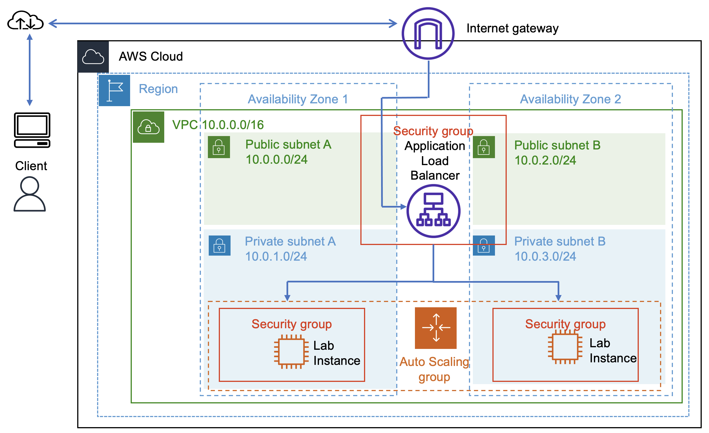

# Compute Lab 174: Scale and Load Balance your Architecture

## Overview
In this lab, I learned to use Elastic Load Balancing (ELB) and Amazon EC2 Auto Scaling to distribute traffic across multiple instances and automatically scale my infrastructure based on demand.  

## Objectives
After completing this lab, I was able to:  
1. Create an AMI from an existing EC2 instance.  
2. Create a load balancer to distribute traffic.  
3. Create a launch template for EC2 instances.  
4. Create and configure an Auto Scaling group in private subnets.  
5. Monitor performance using CloudWatch alarms.  
6. Test auto scaling by simulating high load.  

## AWS Services Used
- Amazon EC2  
- Elastic Load Balancing (Application Load Balancer)  
- Auto Scaling  
- Amazon CloudWatch  
- Security Groups  
- VPC, Subnets, and Availability Zones  

## Architecture Diagram

## Pre-requisites
- A running EC2 instance (Web Server 1) in a public subnet.  
- Configured VPC with public and private subnets.  
- Pre-created Web Security Group allowing HTTP access.  

## Steps Taken
1. **Created an AMI**  
   - Selected Web Server 1 and created an image named `Web Server AMI`.  
   - Noted the AMI ID for launching new instances in the Auto Scaling group.  

2. **Created an Application Load Balancer**  
   - Named it `LabELB` and mapped it across two Availability Zones using public subnets.  
   - Attached a target group named `lab-target-group` and copied the DNS for later testing.  

3. **Created a Launch Template**  
   - Created `lab-app-launch-template` using the AMI, instance type `t3.micro`, and Web Security Group.  

4. **Created an Auto Scaling Group**  
   - Named it `Lab Auto Scaling Group` in private subnets across two Availability Zones.  
   - Configured desired capacity: 2, min: 2, max: 4.  
   - Enabled target tracking based on average CPU utilization (50%).  
   - Attached it to the previously created load balancer.  

5. **Verified Load Balancing**  
   - Confirmed both instances were healthy in the target group.  
   - Accessed the Load Test application via the load balancer’s DNS.  

6. **Tested Auto Scaling**  
   - Simulated high load using the Load Test app.  
   - Observed CloudWatch alarms triggering and additional instances being launched.  

7. **Terminated Web Server 1**  
   - Deleted the original instance as it was no longer needed after creating the AMI.  

## Cleanup
- Terminated any unnecessary EC2 instances.  
- Deleted the load balancer and Auto Scaling group to avoid extra costs.  

## Wrap-up
In this lab, I successfully:
- Built scalable and highly available architecture using ELB and Auto Scaling.
- Gained practical experience creating AMIs, configuring load balancers and setting up Auto Scaling groups.
