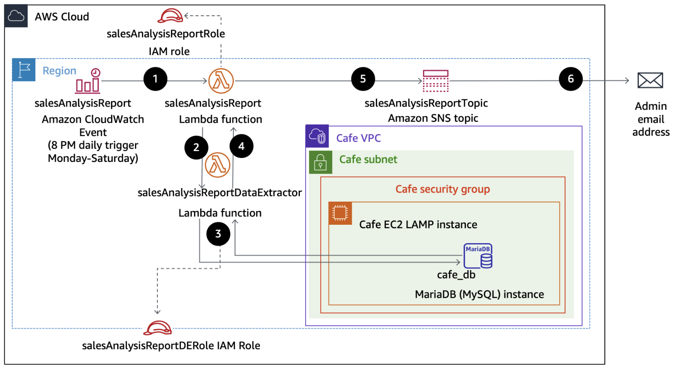

# Compute Lab 178: Working with AWS Lambda

## Overview
In this lab, I deploy and configure an AWS Lambda-based serverless computing solution. The Lambda function generates a daily sales analysis report by retrieving data from a database hosted on an EC2 LAMP instance. The report is then emailed to an administrator via Amazon SNS. Database connection information is securely stored in AWS Systems Manager Parameter Store.  

The architecture involves a scheduled CloudWatch event triggering the main Lambda function, which invokes a secondary Lambda function to extract data, format it, and publish it to an SNS topic for delivery.

## Objectives
After completing this lab, I should be able to:
- Identify IAM policy permissions required for Lambda functions to interact with other AWS services.
- Create a Lambda layer to provide external library dependencies.
- Create Lambda functions that extract database data and send reports.
- Deploy and test Lambda functions initiated on a schedule.
- Use CloudWatch logs to troubleshoot Lambda execution issues.

## AWS Services Used
- **AWS Lambda**: Serverless compute to run Python functions.
- **Amazon EC2**: Hosts the MySQL database in a LAMP stack.
- **AWS Systems Manager Parameter Store**: Stores database credentials securely.
- **Amazon SNS**: Sends sales report notifications via email.
- **Amazon CloudWatch Events (EventBridge)**: Schedules the Lambda function to run daily.
- **IAM**: Provides secure permissions for Lambda functions.

## Architecture Diagram

## Pre-requisites
- Access to the AWS Management Console.
- AWS IAM roles with the necessary permissions:
  - `salesAnalysisReportRole` for main Lambda.
  - `salesAnalysisReportDERole` for data extractor Lambda.
- Python code packages for the Lambda functions (`pymysql-v3.zip` and `salesAnalysisReportDataExtractor-v3.zip`).

## Steps Taken

### Task 1: Observing IAM Role Settings
1. Open IAM roles in the AWS Console.
2. Review `salesAnalysisReportRole` for SNS, Parameter Store, Lambda invocation, and CloudWatch log permissions.
3. Review `salesAnalysisReportDERole` for Lambda execution and VPC access permissions.

### Task 2: Creating a Lambda Layer and Data Extractor Lambda
1. Download the required Lambda files.
2. Create a Lambda layer named `pymysqlLibrary` and upload `pymysql-v3.zip`.
3. Create a Lambda function `salesAnalysisReportDataExtractor` with Python 3.9 runtime and attach the `salesAnalysisReportDERole`.
4. Add the `pymysqlLibrary` layer to the function.
5. Upload the function code from `salesAnalysisReportDataExtractor-v3.zip`.
6. Configure the function's VPC, subnet, and security group to allow database connectivity.

### Task 3: Testing the Data Extractor Lambda
1. Retrieve database credentials from Parameter Store.
2. Create a test event in the Lambda console with the retrieved credentials.
3. Run the function and troubleshoot timeout errors by verifying VPC and security group settings.
4. Populate the database by placing test orders via the café website.
5. Re-run the test to verify correct report extraction.

### Task 4: Configuring Notifications
1. Create an SNS topic `salesAnalysisReportTopic`.
2. Subscribe an email endpoint and confirm subscription.
3. Copy the topic ARN for later use in the Lambda function.

### Task 5: Creating the Sales Analysis Report Lambda
1. Connect to the CLI Host EC2 instance via EC2 Instance Connect.
2. Configure AWS CLI with credentials and region.
3. Use the AWS CLI to create the Lambda function `salesAnalysisReport` with the appropriate role and code package.
4. Configure environment variables, adding `topicARN` for the SNS topic.
5. Test the Lambda function to verify successful execution and email delivery.
6. Add a CloudWatch Events trigger to run the function daily Monday through Saturday at 8 PM (adjusted for UTC).

## Cleanup
- Delete the Lambda functions (`salesAnalysisReport` and `salesAnalysisReportDataExtractor`).
- Remove the Lambda layer `pymysqlLibrary`.
- Delete the SNS topic and subscription.
- Terminate any EC2 instances used solely for this lab.
- Remove any test data created in the database.
- Close the lab session via the AWS training console.

## Wrap-up
In this lab, I successfully:
- Recognized necessary IAM permissions for Lambda functions.
- Created and attached a Lambda layer to manage external library dependencies.
- Developed and tested Lambda functions that interact with a database and send notifications.
- Configured scheduled execution using CloudWatch Events.
- Used CloudWatch logs to monitor and troubleshoot function execution.
- Delivered a serverless solution that generates and emails daily sales reports.
